# snapdine

it lets any cafe owner turn their physical paper menu into a full smart
ordering system in seconds just by taking a photo. it is a real-time qr-based
platform where customers can order together in a shared cart and staff can
manage everything from a dedicated app.

this is my project for #horizons.

customer web app: [order here](https://snapdine-customer-web.vercel.app/order?cafeId=snap-dine&tableId=table-2&token=69c41baef08e41a0) (designed specifically for
mobile, accessed by scanning a qr code)

staff app (android apk): [download app](https://github.com/abhinav4190/snapdine/releases/download/v1.0.0/snapdine-staff-app.apk) (built for both android and
ios)

## demo videos

- customer web app flow: [see web app flow](https://youtube.com/shorts/dp6bmrKlahs?feature=share)
- staff app flow: [staff app demo (ios)](https://youtube.com/shorts/NXvY7-bX1iM?feature=share)

## why i made this

there is this cafe right next to my building that is basically our main
hangout spot. it is run by just two guys: one stays in the kitchen and the other
handles literally everything else like taking orders, waiting tables, and doing
the billing.

i watched them do everything on pen and paper. they would write an order down,
run to the kitchen to tell the other guy, then run back to the table. when the
place got crowded, the paper notes got so messy and unorganized that they would
lose track of orders and mess up the bills. it was pure chaos. i thought i could
build something to actually fix that workflow so they don't have to keep running
back and forth with scraps of paper.

## what it actually is

snapdine is a two-part system built to handle the workflow of a cafe or
restaurant:

- customer side (next.js): you scan a qr on your table and you are in. no
  login or app download needed. this was a deliberate choice because i have
  seen apps fail when customers are forced to sign up just to see a menu. it
  is a web app but designed to feel like a native mobile app. if you are with
  friends, everyone sees the same cart update live. you can track if your food
  is "preparing" or "ready" without having to shout for the waiter.

- staff app (flutter): a multi-role app for the whole team that works on both
  android and ios.
  - the owner: they can manage the cafe/restro. the best part is the ai
    onboarding: you just snap a photo of your current paper menu and it
    instantly builds your digital menu with items, prices, and descriptions.
    from there, they can add new tables, see a live billing dashboard,
    generate qr code prints for tables, reset qr codes whenever they want,
    and can manage and do other things.

  - the waiter: they can take manual orders on their phone for people who
    prefer ordering verbally, which then syncs straight to the kitchen and
    other dashboard views.

  - the chef: they get a kitchen display screen that shows exactly what
    needs to be cooked, grouped by table, updating in real-time as new
    orders come in.

## how it works (the technical bits)

- **qr security:** to stop people from pranking other tables by changing the
  table number in the url, i used rotating secret tokens. each table document
  in firestore has a token that matches the one in the qr. if you try to
  manually edit the url, the token won't match and firestore will block the
  order. resetting a table changes the token so old qr photos become useless.

- **real-time sync:** i used firestore snapshots for everything. the cart, the
  menu, and the order statuses are all live listeners. when the chef clicks
  "done" in the kitchen, the customer's phone updates instantly.

- **concurrency:** i stored order items as a subcollection instead of an array.
  this was important because if a waiter adds a new drink while the chef is
  marking a burger as finished, they won't overwrite each other's changes.

- **staff management:** since firebase auth logs you out if you try to create a
  second user, i built a cloud function to handle adding new staff members.
  this lets the owner build their team without losing their own session.

## tech stack

- **frontend:** next.js (app router), tailwind css v4, typescript
- **mobile:** flutter + riverpod for state management
- **backend:** firebase (firestore, auth, cloud functions)
- **ai:** openai gpt-4o-mini for the menu extraction logic
- **icons/fonts:** phosphor icons and plus jakarta sans

## how to test it (easy flow)

to try the whole flow without setting up the backend, you can do this:

1. staff app: [download](https://github.com/abhinav4190/snapdine/releases/download/v1.0.0/snapdine-staff-app.apk) the pre-built apk.

2. login: use these owner credentials to access a demo cafe:
   - email: snapdine@gmail.com
   - password: snapdine@12

3. customer web: open the customer web app [link](https://snapdine-customer-web.vercel.app/order?cafeId=snap-dine&tableId=table-2&token=69c41baef08e41a0) on your phone.
   you can place orders here and see them pop up instantly in the staff app.

## how to run it from source

### 1. firebase setup

- cd into firebase/functions.
- run npm install.
- deploy everything using firebase deploy --only
  functions,firestore:rules,firestore:indexes.

### 2. customer web

- cd into apps/customer_web.
- npm install.
- create your .env file by copying the keys from .env.example and adding your
  firebase project details.
- run npm run dev.

### 3. staff app

- cd into apps/staff_app.
- flutter pub get.
- run flutterfire configure to link your firebase project.
- create your .env file by copying from .env.example.
- run flutter run.

## screenshots

### 1. ai menu onboarding

taking a photo of a physical menu and letting ai extract all items, categories,
and prices automatically. owners can edit items, add new ones, and toggle stock
availability at any time.

  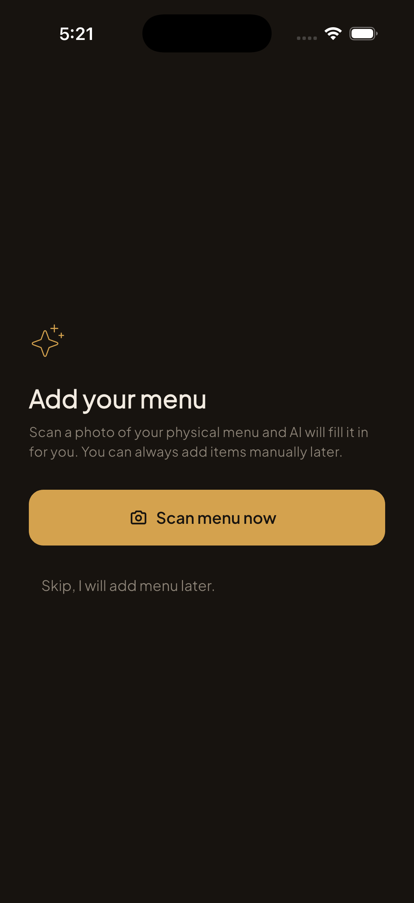
  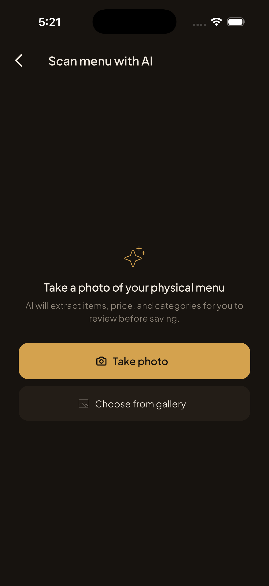
  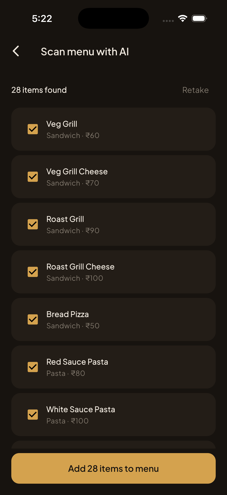
  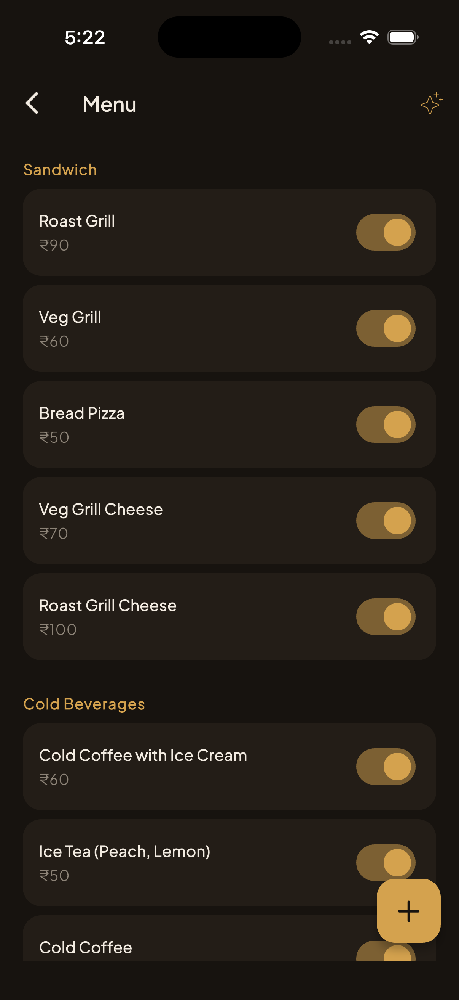
  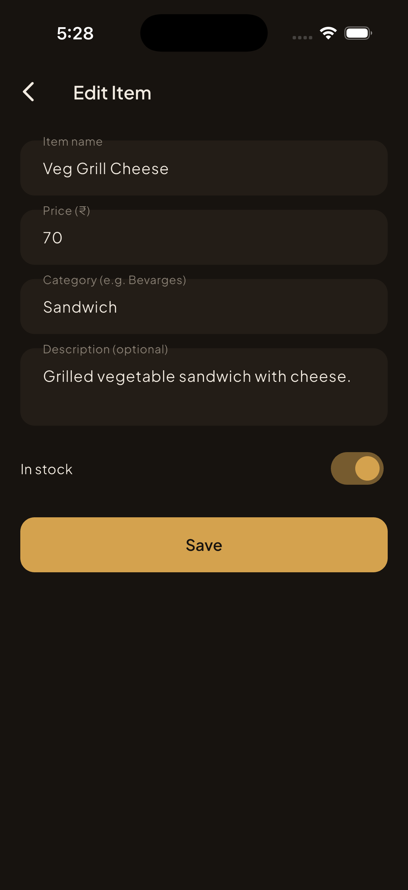

### 2. owner dashboard & management

seeing everything at a glance including active tables and their current bills.
owners can manage cafe settings like gst/service charges, add staff accounts,
generate unique qr codes for tables, and handle all configurations.

  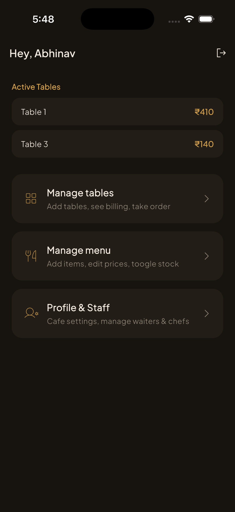
  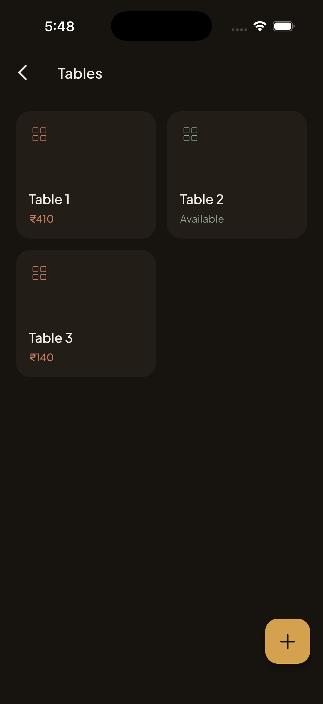
  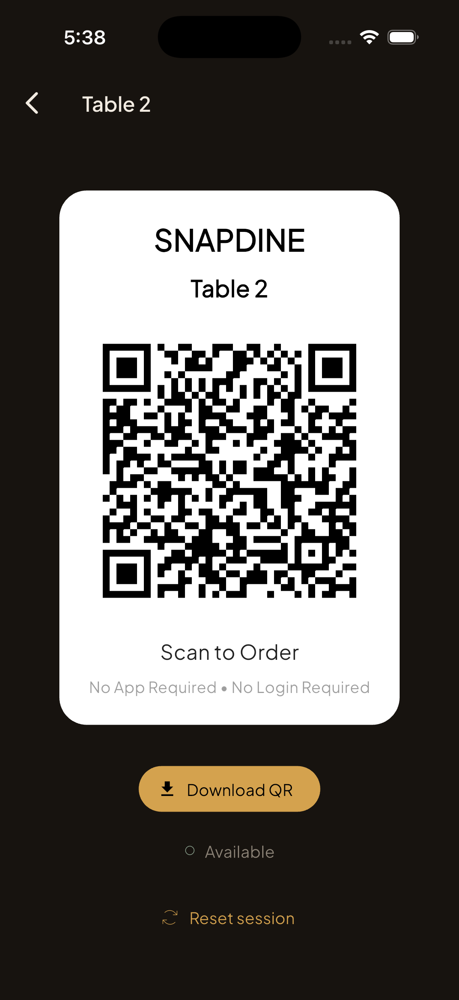
  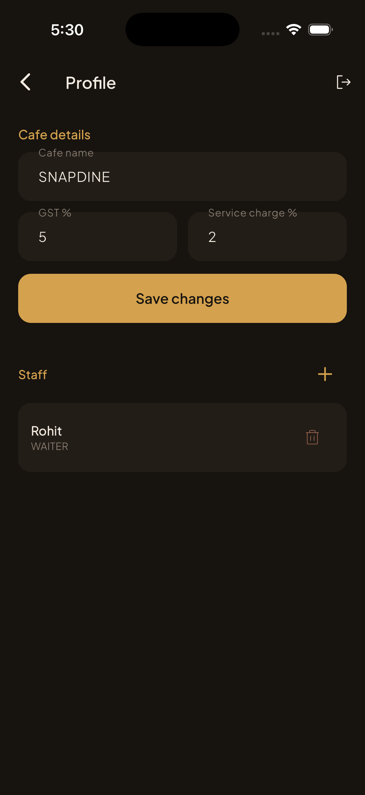

### 3. waiter flow & billing

waiters can monitor active tables, take manual orders for customers, and handle
the entire billing process with digital whatsapp receipts.

  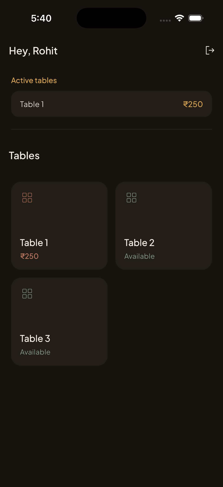
  
  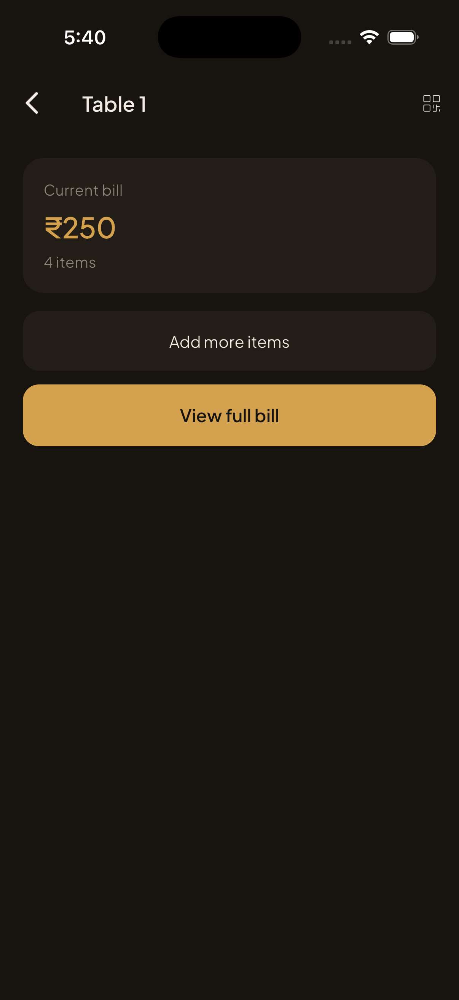
  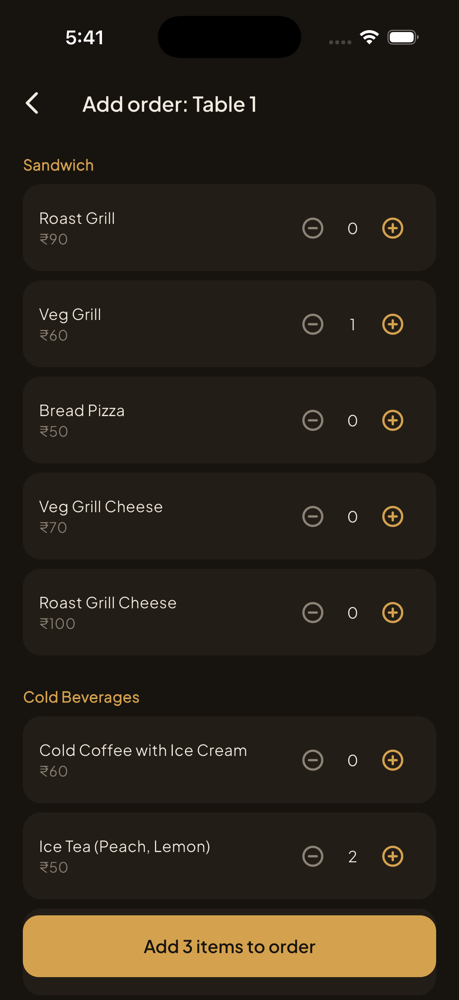
  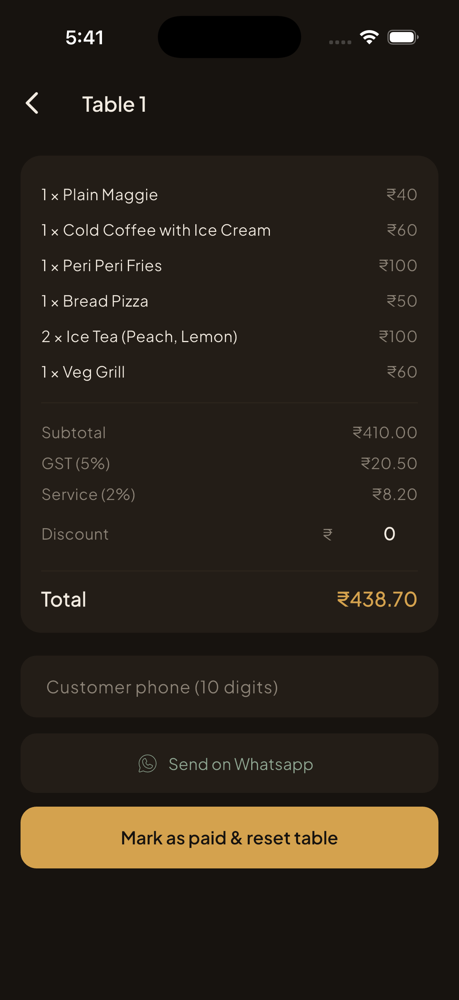

### 4. kitchen display system (kds)

a real-time view for the chef to see pending orders by table and mark items as
"start" or "done."

  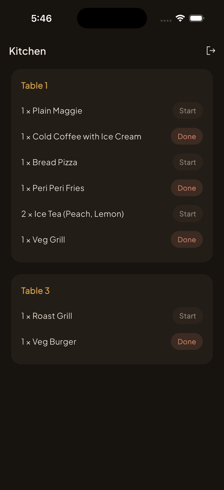

### 5. customer web experience

a mobile-first web app where customers can browse the menu, place orders, and
track their live order status in real time.

  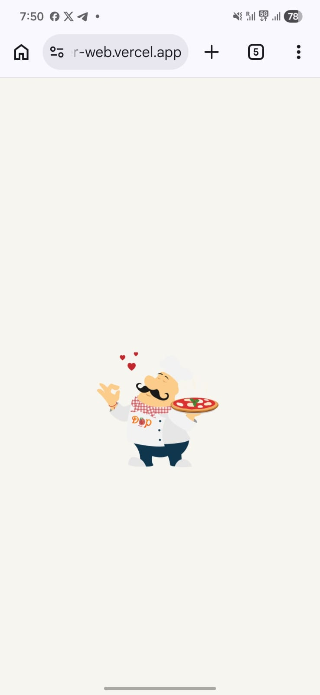
  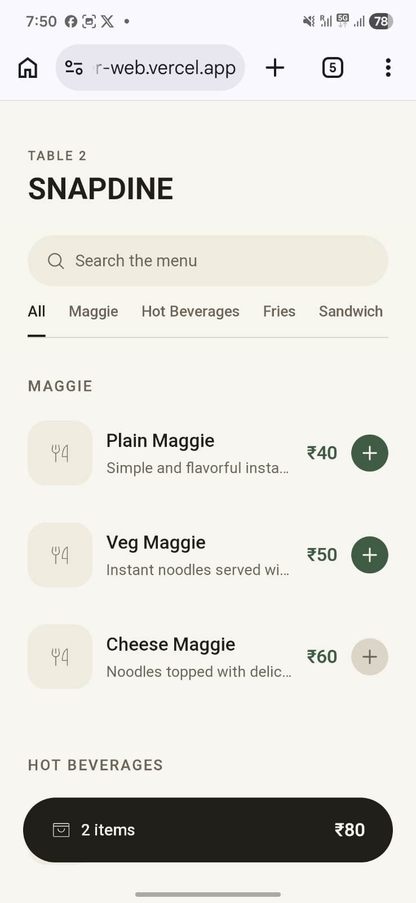
  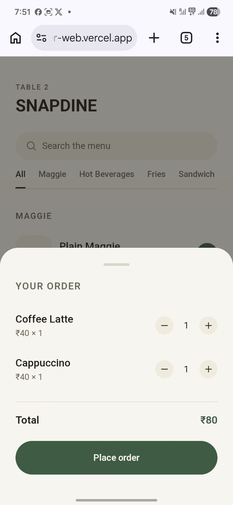
  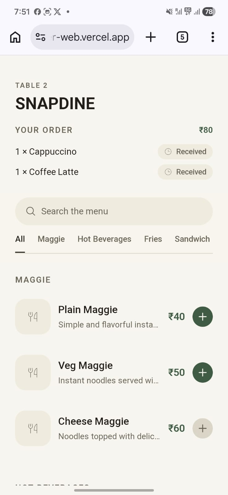

## ai usage, being real about it

used ai a bit here and there, mainly for:

- initial structuring of the project and brainstorming how to approach the
  project.
- helping with the firestore security rules to handle the token validation
  properly.
- writing some scripts to seed data in firestore for initial testing.
- some minor debugging near the end.

most of the core application logic, including the real time listener
architecture, the flutter state management, the qr rotation logic, and every
other core part of the system, was me grinding through it. definitely not more
than 20% ai assisted.

## notes / things worth knowing

- whatsapp receipts: since many small cafes don't have thermal printers, the
  billing system generates a pre-filled whatsapp message with the total
  breakdown so the owner can send it to the customer in one click.
